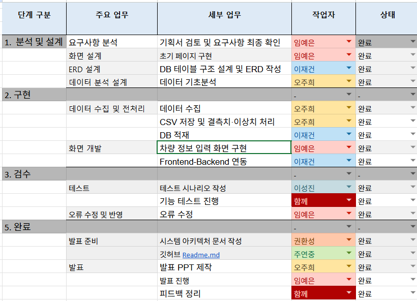
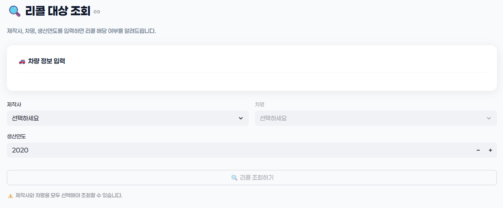
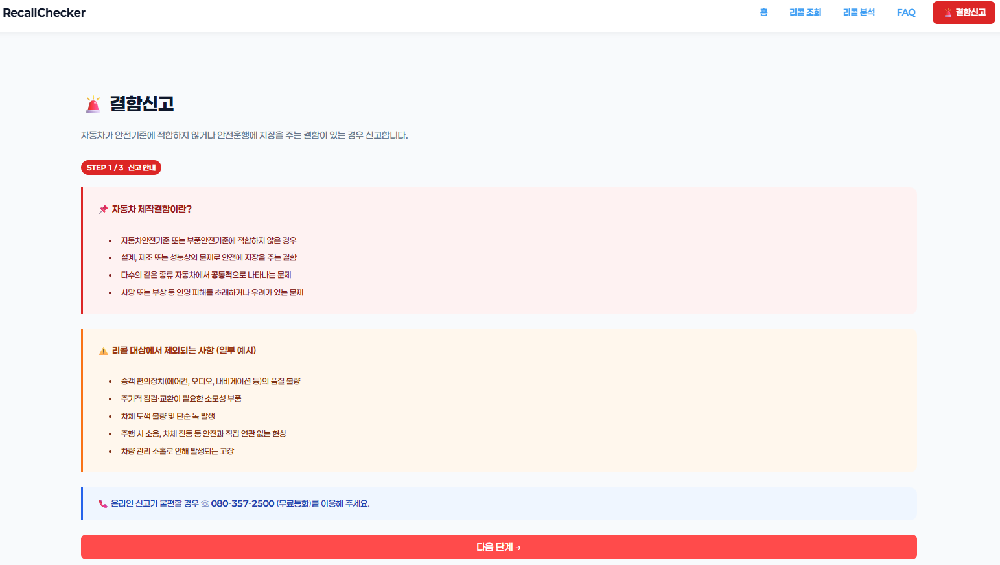
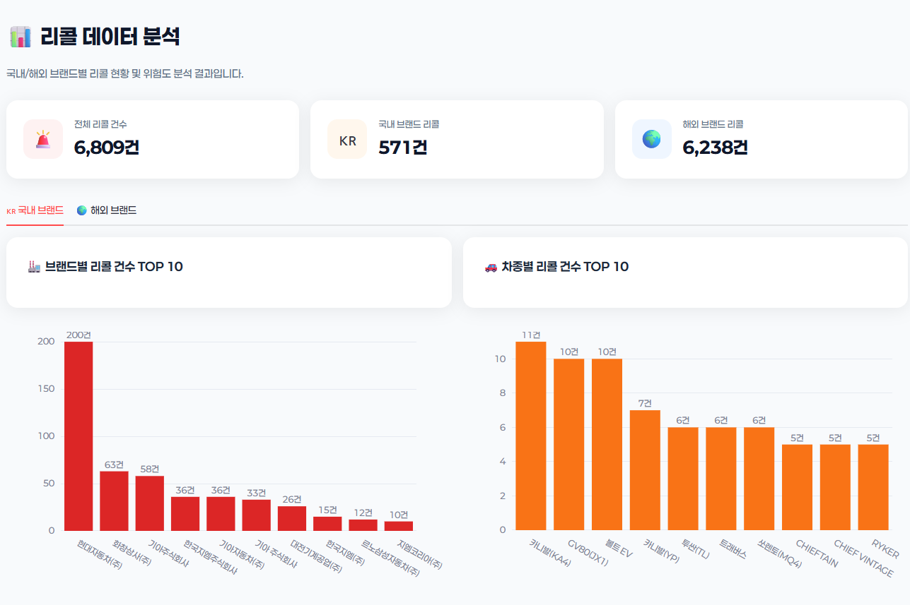
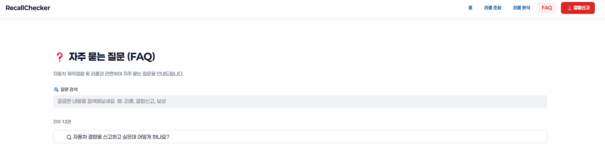
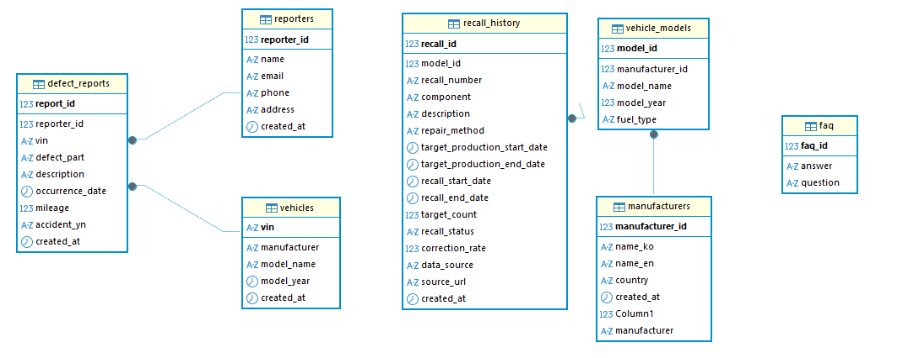
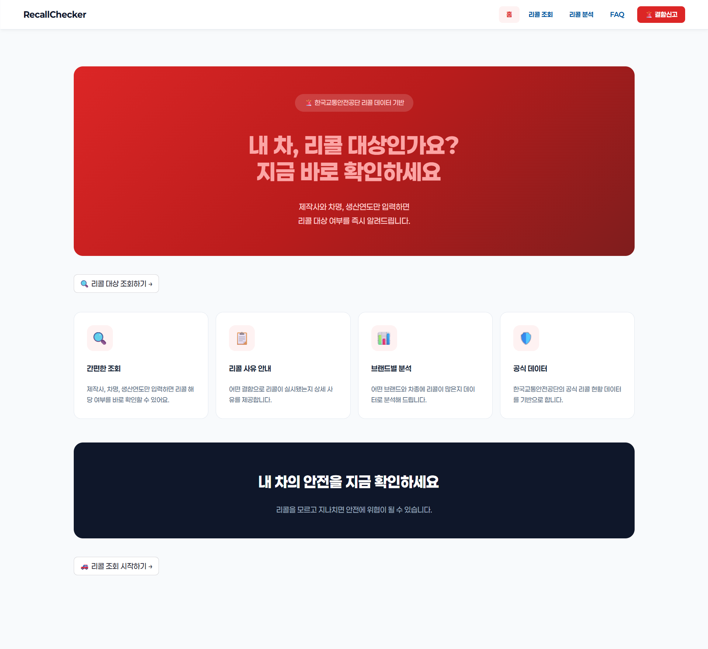
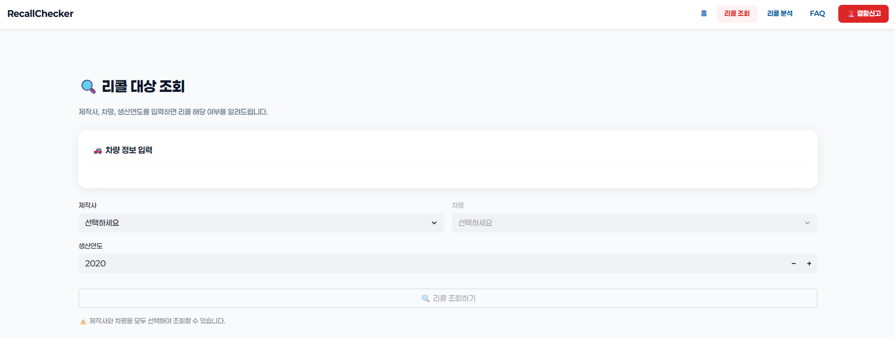

<!-- class: cover -->

2026.02.26

차량 리콜 대상 확인 서비스 RecallChecker

클릭 한 번으로 내 차량 리콜 대상 여부 확인 + 분석 + FAQ + 결함신고

팀/발표자: (팀명/이름 입력) 
데이터: 한국교통안전공단·자동차리콜센터 (2019–2023)

---

<!-- class: toc -->

  

    
목차

    

      
RecallChecker

      
내 차 리콜 조회 & 데이터 분석 서비스

    

  

  

    <ul class="toc-list">
      <li class="toc-item">
01

프로젝트 배경

</li>
      <li class="toc-item">
02

요구사항(기능)

</li>
      <li class="toc-item">
03

데이터 수집 & QC

</li>
      <li class="toc-item">
04

DB 설계(ERD)

</li>
      <li class="toc-item">
05

화면 설계

</li>
      <li class="toc-item">
06

분석 결과 & 결론

</li>
    </ul>
  

---

<!-- class: banded -->
# 01. 프로젝트 배경 (Background)

  

    
정보의 파편화 & 접근성 한계

    

      <ul>
        <li>공공기관 리콜 데이터가 <b>텍스트 위주로 산재</b></li>
        <li>일반 사용자가 본인 차량 정보를 <b>신속·정확하게</b> 파악하기 어려움</li>
        <li>확인 과정이 번거로워 리콜 공지를 <b>놓치기 쉬움</b></li>
      </ul>
    

  

  

    
데이터 시각화/인사이트 부재

    

      <ul>
        <li>브랜드별 결함 추이, 차종별 비교 분석 등 <b>통계 인사이트</b> 채널 부족</li>
        <li>소비자의 합리적 판단을 돕는 <b>비교 기준</b>이 부족</li>
      </ul>
    

  

 

  
소비자 안전권 확보(사회적 필요성)

  

    결함 사례가 복잡화됨에 따라 리콜 이력을 <b>투명하게 공개</b>하고  
    사용자 <b>접근성</b>을 높여야 할 사회적 필요성이 증가
  

---

<!-- class: banded -->
# 01_1. wbs

  

    
  

---

<!-- class: banded -->
# 02. 요구사항(기능) 요약

  

    
01 · 리콜 대상 차량 조회

    
제작사/차명/생산연도 선택 → 리콜 대상 여부 확인

  

  

    
02 · 결함신고

    
리콜 대상이면 즉시 신고(자동 입력 연동)

  

  

    
03 · 리콜 데이터 분석

    
국내/해외, 브랜드·차종·연도별 리콜 건수 시각화

  

  

    
04 · FAQ

    
자주 묻는 질문 검색/열람 + 상담 경로 안내

  

---

<!-- class: banded -->
# 02_1. 리콜 대상 차량 조회

  

  
설계 포인트

  

    <ul>
      <li>가장 중요한 요구사항: <b>내 차가 리콜 대상인지 바로 확인</b></li>
      <li>데이터 신뢰성 확보: <b>한국교통안전공단 CSV</b> 기반</li>
      <li>입력 부담 최소화: <b>선택 박스</b>로 제작사/차명 선택</li>
      <li>리콜 대상일 경우 <b>리콜 사유</b>를 함께 제공</li>
    </ul>
  

---

<!-- class: banded -->
# 02_2. 결함신고

  

    
핵심 UX

    

      <ul>
        <li>리콜 조회 결과가 “대상”이면 <b>신고 버튼 활성화</b></li>
        <li>조회에서 입력한 차량 정보가 <b>신고 폼에 자동 저장</b></li>
        <li>차주는 <b>본인 정보 + 결함 내용</b>만 입력하면 신고 완료</li>
      </ul>
    

  

  

    
  

---

<!-- class: banded -->
# 02_3. 리콜 데이터 분석

  

    
분석 목적

    

      <ul>
        <li>국내/해외 탭으로 <b>리콜 규모</b>를 비교</li>
        <li>브랜드/차종/연도별 리콜 건수 시각화</li>
        <li>TOP10 항목은 <b>주요 리콜사유(상위 3개)</b>까지 함께 확인</li>
      </ul>
      

        구매 전 “리콜이 잦은 브랜드/차종”을 미리 파악하여 합리적 판단 유도
      

    

  

  

    
  

---

<!-- class: banded -->
# 02_4. FAQ

  

  
FAQ 구성

  

    <ul>
      <li>“신고 후 처리 과정”, “리콜 관련 고지 방식” 등 <b>자주 묻는 질문</b> 제공</li>
      <li>검색 기반으로 원하는 답변을 빠르게 탐색</li>
      <li>해결이 어려운 경우를 대비해 <b>상담 경로</b>까지 연결</li>
    </ul>
  

---

<!-- class: banded -->
# 03. 데이터 수집 & QC

  

    
데이터 수집

    

      <ul>
        <li><b>리콜 현황</b>: 한국교통안전공단(TS) 연도별 CSV(2019–2023)</li>
        <li><b>FAQ</b>: 자동차리콜센터 공개 웹 페이지 <b>크롤링</b>(질문/답변 수집)</li>
        <li><b>국내/해외 구분</b>: 제작사 리스트 기준으로 “구분” 컬럼 생성</li>
      </ul>
      

        ※ 리콜 현황은 공공 데이터, FAQ는 공개 페이지 기반 크롤링 데이터
      

    

  

  

    
전처리(QC)

    

      <ul>
        <li>5개년 결합 → 컬럼 정규화</li>
        <li>날짜 파싱/논리 오류(생산 from &gt; to) 점검</li>
        <li>중복 제거(동일 결함 레코드) + 결측/이상치 플래그</li>
      </ul>
      

        데이터 특성상 VIN/대상대수 부재 → <b>건수 중심</b> 분석
      

    

  

---

<!-- class: banded -->
# 04. DB 설계(ERD) 설명

  

  

    
정규화 테이블

    

      <ul>
        <li>manufacturers: 제작사</li>
        <li>vehicles: 차명(차종)</li>
        <li>recall_campaigns: 리콜 공고(캠페인)</li>
        <li>campaign_vehicles: 캠페인-차종 매핑 + 생산기간</li>
      </ul>
    

  

  

    
조회 로직 요약

    

      <ul>
        <li>사용자 입력(제작사/차명/연도) → DB 조회</li>
        <li>해당 연도가 생산기간과 <b>겹치면 리콜 대상</b></li>
        <li>대상일 경우: 리콜사유/개시일/대상기간 제공</li>
      </ul>
    

  

---

<!-- class: banded -->
# 05. 화면 설계

  
사용자 동선

  

    <ol>
      <li><b>메인</b> → 서비스 소개 + CTA</li>
      <li><b>리콜 조회</b> → 제작사/차명/연도 선택 후 결과 확인</li>
      <li><b>결함신고</b> → 대상이면 자동 입력 연동 후 신고</li>
      <li><b>분석/FAQ</b> → 통계 인사이트 확인 + 궁금증 해결</li>
    </ol>
  

---

<!-- class: banded -->
# 05_1. 메인 페이지

  
디자인 의도

  

    <ul>
      <li>상단 레드 그라데이션: 결함의 <b>위험</b>·리콜의 <b>중요성</b> 시각화</li>
      <li>가독성 높은 <b>Paperlogy 폰트</b> 적용(서비스 UI 기준)</li>
      <li>4가지 서비스 키워드/아이콘 배치 → 한눈에 이해</li>
      <li>CTA 버튼으로 조회 페이지 즉시 이동</li>
    </ul>
  

  

    
  

---

<!-- class: banded -->
# 05_2. 리콜 조회 시스템 페이지

  
화면 구성

  

    <ul>
      <li>입력: <b>제작사 → 차명 → 생산연도</b></li>
      <li>리콜대상: <b>빨간색</b>으로 강조 + 결함 사유 노출</li>
      <li>리콜비대상: <b>초록색</b> 안내로 안전 상태 확인</li>
      <li>대상일 때만 “결함 신고하기” 버튼 활성화</li>
    </ul>
  

  

---

<!-- class: banded -->
# 05_3. 리콜 데이터 분석 페이지

  

    
구성

    

      <ul>
        <li><b>상단</b>: KPI 카드(전체/국내/해외 리콜 건수)</li>
        <li><b>탭</b>: 국내/해외 브랜드 분리 비교</li>
        <li><b>중단</b>: 브랜드 TOP10 / 차종 TOP10 그래프</li>
        <li><b>상세</b>: TOP 항목은 Expander로 <b>주요 리콜사유 TOP3</b> 확인</li>
        <li><b>하단</b>: 연도별 리콜 추이(연도 tick 고정)</li>
      </ul>
    

  

  

    
  

  

---

<!-- class: banded -->
# 05_4. FAQ 화면

  

  
화면 구성

  

    <ul>
      <li>검색바(‘리콜/보상/신고’ 키워드로 빠른 탐색)</li>
      <li>질문 목록형(원하는 질문만 선택해 집중 읽기)</li>
      <li>전화번호/온라인 상담 링크(해결 창구 연결)</li>
    </ul>
  

---

<!-- class: banded -->
# 05_5. 결함신고 페이지

  
신고 플로우(3-Step)

  

    <ol>
      <li><b>신고 안내</b>: 결함 정의/제외 항목/상담번호 안내</li>
      <li><b>약관 동의</b>: 처리 과정 신뢰 확보 + 책임감 있는 입력 유도</li>
      <li><b>결함신고 등록</b>: 차량/신고자/결함내용 입력(조회 시 차량정보 자동 저장)</li>
    </ol>
    

      목표: 안내→동의→작성으로 사용자가 “다음 행동”을 고민하지 않도록 구성
    

  

---

<!-- class: banded -->
# 06_1. 사용자 시나리오

  

    <ol>
      <li><b>리콜 조회</b>: 제작사/차명/연도 선택 → 대상 여부 + 결함 사유 확인</li>
      <li><b>결함신고</b>: 대상이면 신고 버튼 → 자동 입력 확인 후 제출</li>
      <li><b>데이터 분석</b>: 국내/해외 탭 + 브랜드/차종 TOP + 연도별 추이 확인</li>
      <li><b>FAQ</b>: 키워드 검색으로 빠르게 답변 확인</li>
    </ol>
  

---

<!-- class: banded -->
# 06_2. 결론

  
RecallChecker 요약

  

    <ul>
      <li>텍스트로 흩어진 리콜 정보를 <b>클릭 한 번</b>으로 확인</li>
      <li>국내/해외 분리 + 시각화 인사이트로 소비자의 <b>합리적 판단</b> 지원</li>
      <li>조회부터 신고까지 <b>한 곳에서 해결</b>하는 서비스로 접근성 향상</li>
    </ul>
  

---

<!-- class: qa -->
# Q&A

---
<!-- class: qa -->
# 감사합니다.